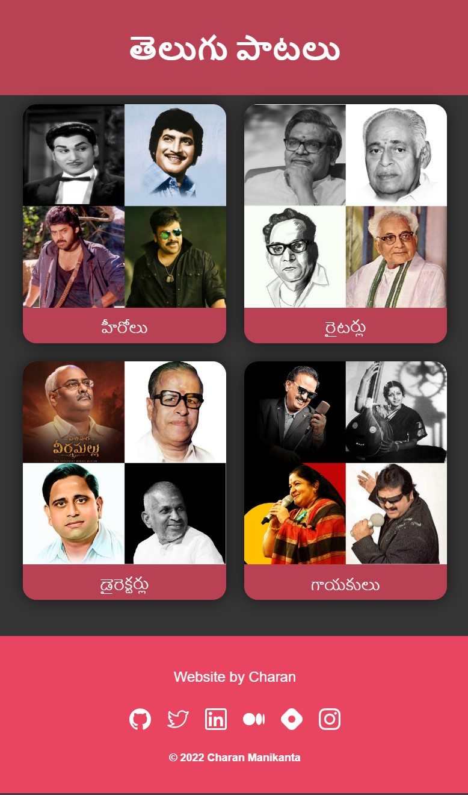

# Telugu Songs Webite

I created this website for my mom because she doesn't like searching for her favorite music on youtube. She can find her favorite music on youtube with just a few clicks.

[This site](https://charanmn7.github.io/telugu-songs/) takes you to some really OG telugu music.

## Table Of Contents 📖

- [Telugu Songs Webite](#telugu-songs-webite)
  - [Table Of Contents 📖](#table-of-contents-)
  - [Overview 🎯](#overview-)
    - [Screenshots 🖼️](#screenshots-️)
    - [Links 📌](#links-)
  - [My Process 📝](#my-process-)
    - [Built with 🛠️](#built-with-️)
    - [What I Learned 🗒️](#what-i-learned-️)
  - [Thanks For Visisting! 👨🏻‍💻](#thanks-for-visisting-)

## Overview 🎯

This is the first website I created in my mother tongue, Telugu (తెలుగు). I creatd this website so that my mom would be able to play her favorite songs on youtube, with just a few clicks.

Growing up, I listened their music and I've listened to the way they categorize and talk about music. With that knowledge, I've organized the music into 4 major categories, each with several options for her to choose from. First, she has to choose one of the four categories, after that she has to choose from all of the available options. Each option in a category leads her to a YouTube playlist I created for each of those options and starts playing music automatically (atleast after an ad or two).

### Screenshots 🖼️

Here's a screenshot: 

### Links 📌

Insert the URLs to your project here, so that the visitor can go try it out.

For example:

- Live Site URL: [https://charanmn7.github.io/telugu-songs/](https://charanmn7.github.io/telugu-songs/)
- Project Repo: [https://github.com/CharanMN7/telugu-songs/](https://github.com/CharanMN7/telugu-songs/)

## My Process 📝

My process was very simple, I just setup my project all the boilerplate code and wrote the code to create one card, wrote its CSS too. The home page has 4 categories that are to be presented as 4 cards, I used the same code for all the 4 cards. And then I used `flex-box` to align the cards.

I added a little footer at the end of the page, just so my mom would know that I created it 😅 (Or maybe I'm just too obsessed with footers). And finally, I used the same code for the rest of the pages.

### Built with 🛠️

Here's what I used to used to build this site;

- CSS (Flexbox, to be specific)
- Canva (To make the images collages)
- YouTube (To make the playlists!😅)

### What I Learned 🗒️

This little project taught me that you can find a way to simplify a whole bunch of things through code. And, this helped me understand the time taken by each of the differnet tasks I did to create the result I expected.

## Thanks For Visisting! 👨🏻‍💻

Check out my other projects:

- [Personal Portfolio Page](https://github.com/CharanMN7/Personal-Portfolio-Page/)
- [Hogwartz Product Landing Page](https://github.com/CharanMN7/Hogwartz-Product-Landing-Page)
- [Green Screen Background Image Editor](https://codepen.io/charan_/pen/OJEWzRX)
- [Simple Paint Canvas](https://codepen.io/charan_/pen/GRGrNyx)
- [Turn a colored image to grey](https://codepen.io/charan_/pen/GRGrEpP)
- [Python program to search through index named files](https://github.com/CharanMN7/file-search-feature)

Let's connect:

- [LinkedIn](https://charanmn7.github.io/telugu-songs/)
- [Twitter](https://twitter.com/CharanMN7)
- [My Blog](https://charan-blog.netlify.app/)
- [Hashnode](https://charanmn7.hashnode.dev/)
- [Medium](https://medium.com/@CharanMN7)
- [CodePen](https://codepen.io/charan_)

> This template was inspired by the [Frontend Mentor](https://frontendmentor.io)
